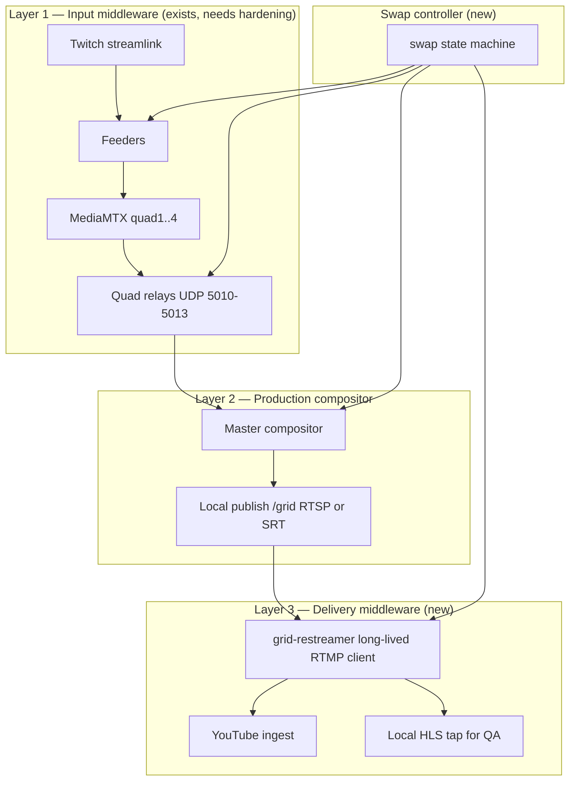

# Live Grid — Stream Issues, Middleware Architecture & Render Setup

**Status:** Planning / documentation only  
**Parent:** [Private lab & swap reliability](live-grid-private-lab-and-reliability.md)  
**Policy:** [CPD-1037](https://aurafluxco.atlassian.net/browse/CPD-1037) — dedicated streaming worker  
**Code:** `lib/live_grid/*`, `scripts/live_broadcast_sidecar.js`, `lib/live_grid/health_metrics.js`  
**Confluence:** C0 Live Grid (30932993) · Server Split C0/C1+ (6881341)

---

## Executive summary

Live Grid failures are not one bug — they are **coupled failure modes** across source churn, compute, transport, and delivery. Patches on `.env` and encoder settings treat **capacity** and **symptoms**; they do not close the **ingest continuity contract**.

**Middleware** means stable local publish points at every layer, with a **delivery process** that owns YouTube RTMP separately from compositor surgery. **Render** means moving the **data plane** (ffmpeg + MTX + restreamer) off the household Mac onto a **dedicated broadcast service**, while C1+ API/dashboard stays the **control plane**.

---

## Current stack (Mac / C0 today)

```
┌─────────────────────────────────────────────────────────────────────────┐
│  pm2 broadcast-sidecar :3001  +  pm2 auraflux :3000 (dashboard)         │
│  pm2 stream-health, stream-av-probe (read-only watchdogs)               │
└─────────────────────────────────────────────────────────────────────────┘
                                    │
Twitch ×4 ──streamlink──► SRT ──► MediaMTX quad1..4 (rtsp://localhost:8554)
                                    │
                         UDP relays (5010–5013)  [restart on EOF/swap]
                                    │
                         master compositor (1× encode)
                                    │
                         ffmpeg tee ──┬──► YouTube RTMP (onfail=ignore)
                                      └──► local HLS (QA mirror, same encode)
```

**What works:** Input stable URLs (CPD-1006), sidecar survives `auraflux` restarts, operator locks, slate/waiting image, prefetch handoff (when used).  
**What does not:** Delivery tied to compositor; swap storms; CPU contention with jobs/Steam; silent RTMP failure.

---

## Full stream issue inventory

Issues below come from `health_metrics.js` playbook, `stream_health_daemon.cjs`, sidecar logs, and production sessions. Each row: what viewers/operators see, root cause, today’s mitigation, and **what middleware fixes**.

### A — Source churn & swaps

| Issue | Symptom | Root cause | Today | Middleware fix |
|-------|---------|------------|-------|----------------|
| **Logoff cluster** | Whole stream down / starved | `onChannelOffline` → immediate `pollOnce`; chained relay restarts | Operator mode, bench fill | **Staged swap:** slate hold → `swap_complete(q)` before cut; debounce burst logoffs |
| **Relay churn** | Frozen tiles, audio cuts, UDP gaps | Relay **exits** on RTSP EOF; not a seamless buffer | Wait 2 min; restart grid | **Input middleware v2:** relay holds slate internally, no process exit; or prefetch keeps RTSP alive |
| **Cold swap** | Tile blip + master timestamp junk | Offline path skips prefetch; kills feeder before new stream ready | `FEEDER_PREFETCH` on manual path only | **Always prefetch-first** on logoff; cold only on timeout |
| **Avatar refresh on swap** | Master exit (`No JPEG data`) | Corrupt/missing avatar PNG mid-graph | `PROTECT_YT_RTMP` skips restart | Validate PNG before master input; decouple avatar from delivery path |
| **Manual dashboard swap** | RTMP blip | Master refresh / relay nudge | Avoid mid-marathon | Swaps stay local; restreamer holds |

### B — Compute & encode profile

| Issue | Symptom | Root cause | Today | Middleware fix |
|-------|---------|------------|-------|----------------|
| **heavy_sources** | Intermittent good ↔ starved | 4× 1080p60 Twitch + 4 relay transcodes + master | Baseline profile; copy relays option | **Dedicated encode host** (Render); copy relays; 720p profile on Linux |
| **total_ffmpeg_cpu** | Stutter, lag, `videoIngestionStarved` | Grid + pipeline jobs + household apps on same Mac | Pause jobs; no Steam | Isolate broadcast worker; no job pipeline on same CPU |
| **master_cpu_high** | YouTube quality drops | Single compositor overloaded | Stop → 720p profile | Restreamer + lighter compositor duty; scale CPU tier on Render |
| **ffmpeg_decode_lag** | A/V drift, drops | Cannot keep real-time | Lower resolution | Profile lock per host; autotune **off** during live (delivery holds if compositor hiccups) |
| **libx264 on Mac PM2** | Starvation (E2E forbids) | PM2 env drift vs baseline videotoolbox | E2E lockdown verify | Render uses **libx264 by design**; Mac keeps videotoolbox |
| **upscale_path** | Mushy tiles | Relay transcode smaller than compositor cells | Match RELAY_SCALE | Copy relays + master scale once |
| **low_relay_bitrate** | Blocky quads | RELAY_BITRATE_K too low | Raise when grid off | Profile per tier; separate from swap logic |

### C — Transport & timing

| Issue | Symptom | Root cause | Today | Middleware fix |
|-------|---------|------------|-------|----------------|
| **dts_errors** | Glitches, master/relay restarts | UDP/TS timestamp discontinuities | AAC re-encode on relays | Staged swap + continuous relay buffer; restreamer re-clocks to RTMP |
| **rtsp_probe_fail** | Blank quadrant | Feeder/relay dead | Self-heal; swap quad | Stable MTX path + swap gate |
| **UDP master refresh** | ~5s YouTube blip | Forced master reconnect on swap | `UDP_MASTER_REFRESH_MS=0` | Not needed if delivery is restreamer |
| **RTMP tee onfail=ignore** | Local “running”, YT dead | Failed FLV leg ignored | Manual restart | **Delivery middleware:** restreamer health = truth; alert on stall |
| **Choppy on-air audio** | Cuts during relay restart | Same UDP gap path | av-probe flags | Audio hold or bed during `SWAPPING`; copy path + stable relays |

### D — Process lifecycle & ops

| Issue | Symptom | Root cause | Today | Middleware fix |
|-------|---------|------------|-------|----------------|
| **sidecar_restarts_tonight** | Repeated 30–90s bad quality | pm2 restart; 111+ restarts seen | Lock profile; don’t restart live | Render: **one service role**; graceful SIGTERM; restreamer survives compositor recycle |
| **grid_session_reset** | Warm-up churn after restart | All relays + master cold start | Wait 10+ min | Persistent disk or MTX buffer; staged warm-up before `GO LIVE` public |
| **master_restarts** | Viewer blips | encode reload, avatar, DTS | PROTECT_YT_RTMP, autotune off | Restreamer holds YT session across compositor restart |
| **auraflux restart** | Dashboard 502, grid OK | Sidecar isolated ✓ | Sidecar pattern | Same on Render: broadcast service independent of API deploys |
| **Dashboard encoder ≠ master** | Confusing ops (libx264 vs videotoolbox) | Stale status fields / PM2 env | Read master line in e2e verify | Single status source: compositor + restreamer + YT API |

### E — YouTube & listings

| Issue | Symptom | Root cause | Today | Middleware fix |
|-------|---------|------------|-------|----------------|
| **youtube_stale_local** | Listing dead, ffmpeg still pushing | RTMP bypass + ended broadcast | youtube_sync watchdog | Restreamer detects reject/starve; auto-stop or alert |
| **youtube_not_live** | Not accepting ingest | Wrong key / listing | Env attach flow | Unchanged; control plane validates before GO LIVE |
| **videoIngestionStarved** | Spinning / low quality | CPU or broken timestamps | Profile tuning | Delivery + compute isolation; not tee-only |
| **Stale broadcast id in status** | Ops confusion | Env vs API drift | Trust env + sync | Health daemon polls YT ingest API every tick |

### F — Audio policy

| Issue | Symptom | Root cause | Today | Middleware fix |
|-------|---------|------------|-------|----------------|
| **music_guard** | Audio hops / mutes | Gemini flags music on quad | `MUSIC_GUARD=off` overnight | Unrelated to middleware; keep off until stable |
| **fallback_music** | Copyright bed on-air | All quads flagged / slate | Expected sometimes | Staged swap reduces false slate→bed transitions |
| **AAC copy mode** | No hot-switch audio | Requires master restart | AUDIO_DIRECT on | Keep volume gates; delivery holds during rare restarts |

---

## Target middleware architecture (three layers)

Middleware is **not** “local HLS tee.” It is **stable publish/consume boundaries** with explicit **hold** semantics during transitions.



### Layer 1 — Input middleware (harden)

**Today:** MTX stable path + relay restart on EOF.  
**Target:**

- Prefetch-first on every swap (logoff + manual + bench).
- Relay **continuity process** — internal slate buffer, avoid exit where possible.
- `swap_complete(q)` gates before feeder cuts to live tile.
- Debounced `pollOnce` (batch empty seats; max one replace per N seconds globally).

### Layer 2 — Compositor → local publish

**Today:** Master reads UDP, tees RTMP + HLS in one process.  
**Target:**

- Compositor writes only to **local publish point** (`rtsp://127.0.0.1:8554/grid` or SRT).
- Compositor may restart without touching YouTube.
- Local watch reads **publish point** or restreamer tap — still true QA.

### Layer 3 — Delivery middleware (grid-restreamer)

**New process** (separate ffmpeg or MTX RTMP forward):

- Owns YouTube RTMP connection end-to-end.
- On compositor stall / swap storm: **hold** last GOP or full-frame slate (configurable).
- Resumes when Layer 1+2 report stable (`no quad in SWAPPING` + publish probe OK).
- Exposes `deliveryHealth` — connected, bitrate, last keyframe age, YT API status.

### Swap state machine (cross-layer)

| State | Layer 1 | Layer 2 | Layer 3 |
|-------|---------|---------|---------|
| `LIVE` | All quads feeding | Compositing to `/grid` | Forwarding to YT |
| `SWAPPING(q)` | Slate tile q; prefetch | May show slate in grid | **Hold** or per-tile slate |
| `SWAP_COMPLETE(q)` | Quad q stable on MTX | Live tile q | Resume / continue |
| `DEGRADED` | Multiple failures | Compositor errors | Hold + alert ops |

---

## Issue → middleware layer map (quick reference)

| If the problem is… | Fix at layer |
|--------------------|--------------|
| Streamers log off → stream down | L1 staged swap + L3 hold |
| Relay restart count [4,6,9,9] | L1 relay continuity |
| Mac CPU / Steam / jobs competing | Render dedicated worker (capacity) |
| YouTube dead, local watch OK | L3 delivery (break tee coupling) |
| Sidecar restart blip | L3 hold + warm-up gate before public |
| DTS / timestamp errors | L1+L2 stable swap + L3 re-clock |
| Dashboard lies about health | L3 metrics + YT API in status |

---

## Render target architecture

### Control plane vs data plane

| Role | Where | Responsibility |
|------|-------|----------------|
| **Control plane** | `auraflux-api` + Next.js app on Render/Vercel | GO LIVE API, YouTube OAuth, listing create, dashboard, Jira health |
| **Data plane** | **`auraflux-broadcast`** (new Render service) | Sidecar, MTX, feeders, relays, compositor, restreamer, ffmpeg |
| **Watchdogs** | Broadcast service or cron | stream-health equivalent, private listing soak |

**CPD-1037:** Livestreams stay C0 until dedicated worker exists → this service **is** that worker.

### Recommended Render services

```
┌──────────────────────┐         private network          ┌─────────────────────────────┐
│  auraflux-api        │  LIVE_SIDECAR_URL (internal)     │  auraflux-broadcast         │
│  (existing web svc)  │ ───────────────────────────────► │  (new — DO NOT share with   │
│  proxies /live-grid/*│                                  │   job pipeline workers)     │
└──────────────────────┘                                  │                             │
         │                                                  │  • broadcast-sidecar :3001 │
         │                                                  │  • MediaMTX :8554 / :9998  │
         ▼                                                  │  • ffmpeg compositor      │
┌──────────────────────┐                                  │  • grid-restreamer        │
│  auraflux-app        │                                  │  • optional persistent disk│
│  (dashboard UI)      │                                  └──────────────┬──────────────┘
└──────────────────────┘                                                 │
                                                                         │ RTMP outbound
                                                                         ▼
                                                              YouTube Live ingest
```

| Service | Render type | Notes |
|---------|-------------|-------|
| `auraflux-broadcast` | **Web service** (private preferred) or **Private service** | Must bind `0.0.0.0:$PORT` for health; ffmpeg runs in same container |
| MediaMTX | Sidecar binary in same Docker image | quads + `/grid` publish |
| Health | Same container cron loop or second lightweight process | Write to logs + optional Postgres/metrics |
| Job pipeline | **Separate** existing workers | Never co-schedule with broadcast |

**Do not** run Live Grid on `auraflux-api-staging` job pipeline instances — different CPU profile, deploy churn, no ffmpeg guarantee.

### Docker / runtime (Linux profile)

Mac baseline **does not copy verbatim**:

| Setting | Mac (today) | Render broadcast |
|---------|-------------|------------------|
| `LIVE_GRID_ENCODER` | `videotoolbox` | **`libx264`** (no Apple Silicon VT) |
| `LIVE_GRID_RELAY_TRANSCODE` | `on` (baseline) | **`off`** (copy relays) — CPU headroom |
| `LIVE_GRID_TWITCH_QUALITY` | 1080p60 ladder | **`720p60,720p,best`** initially — prove stability |
| `LIVE_GRID_OUTPUT_W×H` | 1920×1080 | 1920×1080 or **1280×720** soak-first |
| `LIVE_GRID_BITRATE_K` | 6800 | 4500–6500 tuned to instance |
| `FFMPEG_PATH` | homebrew ffmpeg-full | Docker `ffmpeg` with libx264, drawtext, zmq |
| MTX / tmp | local disk | **Persistent disk** mounted at `/var/live_grid` if using file HLS buffer; prefer RTSP middleware |

**Image contents:** Node 20+, ffmpeg, MediaMTX, streamlink (Twitch ingest), fonts for drawtext, brand assets.

### Middleware on Render (ephemeral FS constraint)

Render filesystem is **ephemeral** — file-based HLS segments in `tmp/live_grid/preview/` are lost on deploy/restart.

| Approach | Render-safe? | Use for |
|----------|------------|---------|
| HLS files on disk | ⚠️ Only with **persistent disk** | QA tap, short buffer |
| **RTSP/SRT publish to MTX** | ✅ Yes | Layer 2 → Layer 3 middleware |
| RTMP restreamer | ✅ Yes | Layer 3 → YouTube |
| UDP localhost relays | ✅ Yes | Same as Mac (ports on loopback in container) |

**Recommended:** Compositor → `rtsp://127.0.0.1:8554/grid` → restreamer ffmpeg → YouTube. Local QA via MTX read or sidecar HTTP proxy — not production-critical path on ephemeral segments.

### Networking & secrets

| Variable | Source |
|----------|--------|
| `LIVE_GRID_RTMP_URL`, `YOUTUBE_OAUTH_*` | Doppler → broadcast service |
| `LIVE_SIDECAR_URL` | Internal URL on API: `http://auraflux-broadcast:3001` |
| Twitch / streamlink | No auth for public streams |
| API → broadcast | Render **private network**; broadcast not public except health |

`lib/broadcast/sidecar_client.js` in `cwn-production` already proxies `/live-grid/*` — point `LIVE_SIDECAR_URL` at broadcast service internal hostname.

### Scaling & deploy rules

| Rule | Why |
|------|-----|
| **Single instance** for broadcast | One compositor + one RTMP publisher; no horizontal scale without sharding streams |
| **autoDeploy: off** on broadcast | Deploy only after soak; same as auraflux-api today |
| **Graceful SIGTERM** | Restreamer holds YT 5–10s while compositor drains; implement in sidecar shutdown |
| **No zero-downtime multi-instance** | Need active/passive or accept blip on deploy — plan maintenance windows |
| **Instance size** | Start **Standard** (2 CPU+) for 4 copy relays + 1080p master; profile down if starved |

### Phased Render rollout

| Phase | Action | Pass bar |
|-------|--------|----------|
| **R0** | Jira epic + Confluence HOW; Dockerfile scaffold | Builds locally |
| **R1** | `auraflux-broadcast-staging` private service; `localOnly` + MTX health | Compositor runs 30 min on Render |
| **R2** | Add grid-restreamer; private YouTube listing | 3 scripted logoffs, YT stays live |
| **R3** | Wire `LIVE_SIDECAR_URL` on staging API; dashboard GO LIVE → Render | End-to-end from dashboard |
| **R4** | Overnight private soak (6h) | Burst logoff matrix passes |
| **R5** | Production cutover; Mac encode off | 3 successful nightly streams |

Mac remains **fallback** until R4 passes.

---

## Mac vs Render — when to fix what

| Work item | Mac first | Render required |
|-----------|-----------|-----------------|
| Staged swap + `swap_complete` | ✅ Lab on private listing | Port same code |
| grid-restreamer | ✅ Prototype locally | ✅ Production home |
| Relay continuity | ✅ | ✅ |
| CPU / Steam isolation | Partial (house rules) | ✅ Dedicated worker |
| libx264 profile tuning | Optional | ✅ Required |
| Dashboard delivery health | ✅ | ✅ via API proxy |

**Order:** Implement middleware logic on Mac (private lab) → prove pass bar → deploy same `lib/live_grid` to broadcast Docker → cut over.

---

## Observability target (post-middleware)

Extend `stream_health_daemon` / dashboard with:

| Signal | Source |
|--------|--------|
| `compositor.health` | master up, CPU, restarts |
| `delivery.health` | restreamer connected, last keyframe age |
| `youtube.ingest` | Data API / Studio health (`good`, `videoIngestionStarved`) |
| `swap.state` | quads in `SWAPPING`, time in hold |
| `relay.churn` | restarts per session (target: 0 during steady state) |

**Rule:** `running: true` is necessary, not sufficient. **Green = delivery.health + youtube.ingest.**

---

## Config profiles (summary)

| Profile | Host | Use |
|---------|------|-----|
| `live_grid_profile_baseline.json` | Mac overnight | Production when middleware not shipped |
| `live_grid_profile_e2e.json` | Mac go-live lockdown | Nightly private → public |
| **`live_grid_profile_render.json`** (to create) | Render broadcast | copy relays, libx264, 720p soak option |
| **`live_grid_profile_middleware_lab.json`** (to create) | Mac or Render | restreamer on, staged swap on, private listing |

---

## Ship after stream ends (built, not active until you apply)

Code is on disk **behind flags default `off`**. The running `broadcast-sidecar` process is **unchanged** until you restart it with new env.

### When the stream is over

```bash
cd ~/cwn-c0

# 1) Stop encoder (listing stays open unless endBroadcast:true)
curl -s -X POST http://127.0.0.1:3001/live-grid/stop \
  -H 'Content-Type: application/json' -d '{}' | python3 -m json.tool

# 2) Apply middleware env from locked profile
bash scripts/live_grid_middleware_ship.sh apply

# 3) Restart sidecar to pick up env (NOT before stream ends)
pm2 restart broadcast-sidecar --update-env

# 4) Verify flags + status shape
bash scripts/live_grid_middleware_ship.sh verify

# 5) Private lab start (see config/live_grid_profile_middleware_lab.json)
curl -s -X POST http://127.0.0.1:3001/live-grid/start \
  -H 'Content-Type: application/json' \
  -d '{"privacyStatus":"private","freshListing":true,"operatorMode":true,"programMode":"grid"}' \
  | python3 -m json.tool
```

Check `middleware.outputMiddleware`, `middleware.restreamer.running`, and `middleware.swap` on `/live-grid/status`.

### Rollback

```bash
bash scripts/live_grid_middleware_ship.sh restore
pm2 restart broadcast-sidecar --update-env
```

Profile: `config/live_grid_profile_middleware_lab.json` (copy relays + middleware flags).

---

| Ticket / page | Content |
|---------------|---------|
| CPD-1037 (parent) | Dedicated streaming worker policy |
| **CPD-XXXX epic** | Middleware + ingest continuity |
| **CPD-XXXX** | Layer 1 — staged swap + relay continuity |
| **CPD-XXXX** | Layer 3 — grid-restreamer |
| **CPD-XXXX** | Render `auraflux-broadcast` service |
| Confluence HOW | This doc + sequence diagrams + Render blueprint |
| Confluence HOW | Swap & Ingest Contract (pass/fail tests) |

---

## Related docs

- [Private lab procedures](live-grid-private-lab-and-reliability.md)
- [Brand overlay & go-live](live-grid-branding.md)
- [C0 repository policy](../C0_REPOSITORY_POLICY.md)
- `config/live_grid_profile_baseline.json`
- `.cursor/agents/live-stream-video-monitor.md`
